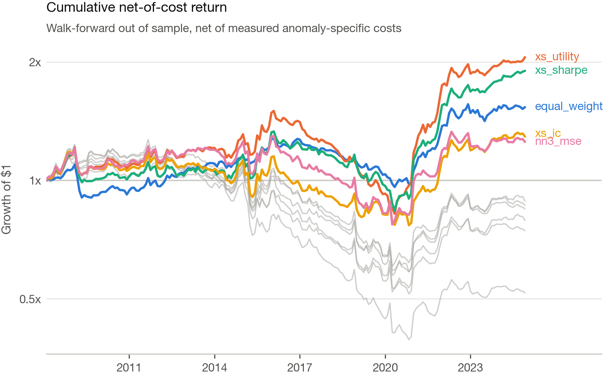
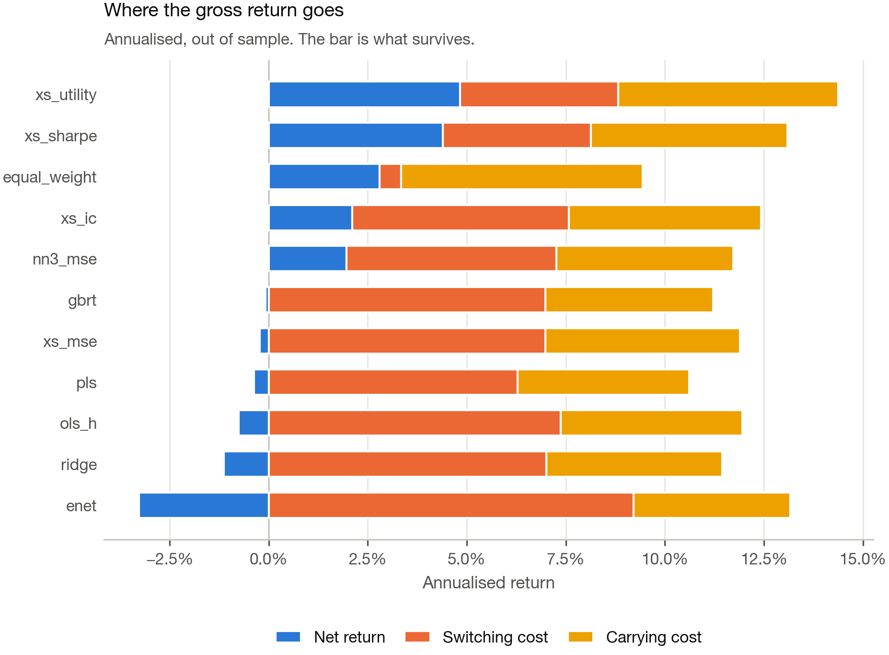

# Cost-aware deep allocation across published asset-pricing anomalies

**Machine Learning in Finance (FIN-407), EPFL — project.**

Most machine-learning work on asset returns minimises squared forecast error and
then, as a separate afterthought, turns the forecasts into a portfolio. A fund is
not paid for squared error. It is paid for the Sharpe ratio of a book, *after* the
cost of trading into it and the cost of carrying it.

This project closes that gap and measures what it is worth. The asset universe is
the ~200 published cross-sectional anomalies of the Open Source Asset Pricing
project; the problem is how much capital to allocate to each one, month by month.
One architecture — a permutation-equivariant network over the whole monthly
cross-section — is trained under four objectives, with data, folds and portfolio
construction held fixed, so the only thing that varies is what the model is asked
to maximise.

## The result

Out of sample, 2008-02 to 2024-12 (203 months), net of measured anomaly-specific
transaction costs:

| Model | Objective | Gross Sharpe | **Net Sharpe** | Turnover | Break-even cost |
|---|---|---|---|---|---|
| `xs_utility` | net-of-cost mean-variance | 1.38 | **0.45** | 0.67 | 183 bps |
| `xs_sharpe` | net-of-cost Sharpe | 1.21 | **0.40** | 0.62 | 179 bps |
| `equal_weight` | *(1/N benchmark)* | 1.32 | **0.39** | 0.09 | 866 bps |
| `xs_ic` | rank correlation | 1.17 | 0.19 | 0.91 | 115 bps |
| `nn3_mse` | squared error, per-asset | 1.07 | 0.17 | 0.88 | 113 bps |
| `gbrt` | squared error (LightGBM) | 1.03 | −0.01 | 1.17 | 81 bps |
| `xs_mse` | squared error | 1.07 | −0.02 | 1.17 | 85 bps |
| `ridge` | squared error, linear | 0.97 | −0.10 | 1.17 | 75 bps |
| `enet` | squared error, sparse | 0.94 | −0.30 | 1.54 | 55 bps |

Three things are worth stating precisely, including the one that is negative.

**1. Gross performance and net performance rank the models differently.**  Every
model looks good gross: gross Sharpe ratios run from 0.94 to 1.38 and eight of the
nine beat the benchmark's gross 1.32 or come close. Net of costs, only the two
cost-aware objectives clear 1/N, and five of the nine *lose money outright*. A
paper that stopped at the gross number would have reported nine successes.

**2. Predictive accuracy does not order the models by economic value.**
`xs_ic` has the highest information coefficient (0.101) and the highest
out-of-sample R² (1.48%) of any model, and earns a net Sharpe of 0.19.
`xs_utility` has the *lowest* IC (0.063) and the best net Sharpe. The two extremes
are inverted — but the stronger claim does not survive checking: across all ten
models the Spearman correlation between IC and net Sharpe is −0.14 (*p* = 0.70,
*n* = 10), i.e. indistinguishable from zero. What the data supports is the weaker
and still useful statement: **knowing which model forecasts best tells you nothing
about which model earns most.** A model-selection procedure that ranks candidates
on IC is choosing close to at random.

**3. No model beats 1/N by a statistically significant margin — but the
cost-blind ones lose to it significantly.**  Regressed on the benchmark, the best
model's alpha is +1.5%/year with a HAC *t* of 0.88: positive, not significant,
and its beta to the benchmark is 1.21, so a good part of the raw return
difference is leverage rather than skill. Meanwhile `ridge` (*t* = −1.97),
`xs_mse` (−2.08) and `enet` (−2.55) destroy value against 1/N at conventional
significance. **The defensible claim is not "machine learning beats equal
weighting". It is that the choice of objective decides whether ML allocation
loses to 1/N or merely ties it.** 1/N is very hard to beat, which is what
DeMiguel, Garlappi and Uppal (2009) found, and this project does not overturn it.



## The mechanism — and a hypothesis that did not survive

The obvious story is that a cost-aware model learns to avoid anomalies that are
expensive to carry. **That is not what happens.** Sorting anomalies into quintiles
by measured carrying cost, the best model's average tilt away from 1/N is
−0.0007 on the cheapest quintile and +0.0004 on the dearest: essentially flat, and
if anything mildly the wrong way.

What it actually learns is **allocation persistence**. Turnover falls from
0.88–1.54 for the cost-blind objectives to 0.62–0.67 for the cost-aware ones, and
the annual switching bill falls from 5.3–9.2% to 3.7–4.0%. Carrying cost is
similar for everybody (3.9–6.1%), because every model ends up holding something
close to the full anomaly universe. The edge is in *not rebalancing*, not in
*what is held*.



## Data — all of it free

No paid subscription is needed; `make all` reproduces every number from a clean
clone.

| Source | What | Size |
|---|---|---|
| [Open Source Asset Pricing](https://www.openassetpricing.com) — `PredictorPortsFull` | long-short monthly return of 212 published anomalies, 1926–2024 | 78 MB |
| — `SignalDoc` | what each anomaly is, when it was published, what the original paper found | 65 KB |
| — liquidity-screened portfolio sets | the same anomalies rebuilt on large caps and on stocks above $5 (capacity checks) | 2 × 20 MB |
| — `signed_predictors_dl_wide` | 209 firm-level signals, 5.4 M stock-months — used **once**, to measure turnover | 2.4 GB |
| [Ken French's data library](https://mba.tuck.dartmouth.edu/pages/faculty/ken.french/data_library.html) | FF5 + momentum + risk-free rate, for the alpha regressions | 34 KB |

### Three construction decisions that carry the weight

**The universe is point-in-time by publication date.** An anomaly becomes
investable in the January *after* its paper appeared. An investor in 1980 could
not allocate to an anomaly documented in 2005, and a backtest that lets them is
measuring a time machine. This is also what makes "years since publication" an
honest feature rather than a leak — by construction it is never negative. The
screen is expensive: it cuts 173,302 anomaly-months to 50,370 and pushes the
sample start to 1994, because fewer than 20 anomalies had been published before
then.

**Only variables knowable at time *t* become features.** Chen & Zimmermann's
replication-quality grades and the 2025 citation counts sit in the metadata file
and are strongly related to future returns — precisely because that relationship
is hindsight. They are excluded. So are raw publication years, which with only 212
assets come close to naming each anomaly and would let a network memorise which
specific anomalies paid off. What survives is the strategy's own definition
(holding period, quantile, weighting), the effect size reported in the original
paper, and everything derivable from returns realised before *t*.

**Costs are measured, not assumed.** Each anomaly's intrinsic monthly turnover is
reconstructed from the firm-level signals by rebuilding its decile book month by
month, on an expanding window so nothing about the future leaks in. The range is
enormous — a factor of 500:

| | Monthly turnover | Carrying cost at 25 bps |
|---|---|---|
| `CitationsRD`, `GP`, `PatentsRD` (annual accounting) | 0.008 | 0.02 %/yr |
| median anomaly | 0.129 | 0.39 %/yr |
| `dCPVolSpread`, `ChangeInRecommendation` (options, analyst revisions) | 3.98 | 12 %/yr |

Turnover is nearly a structural constant of each signal — its cross-decade
correlation is 0.985 to 0.997 — which is what makes an expanding-window estimate
safe to use as both a feature and a price.

## Method

### Walk-forward, purged, embargoed

The sample is walked forward one year at a time. Each refit trains on everything
up to a four-year validation block used for early stopping and hyper-parameter
selection, then predicts the following year, which it has never seen. Between
training and validation sits a **12-month embargo**, because several anomalies are
built from annual accounting data and a shorter gap would put the same
fundamentals on both sides of the boundary. `tests/test_split.py` asserts these
properties mechanically rather than trusting that they were implemented correctly.

### The cost-aware objective

For a window of consecutive months, with weights `w[t]` set at the close of month
`t`:

```
gross[t]     = w[t] · r[t+1]
drifted[t-1] = w[t-1] * (1 + r[t]) / (1 + w[t-1] · r[t])
switching[t] = Σ_i switch_i · |w[t,i] - drifted[t-1,i]|
carrying[t]  = Σ_i carry_i  · |w[t,i]|
loss         = -mean(net) / std(net) * √12,   net = gross - switching - carrying
```

Two details do real work. Costs are charged against the **drifted** book, not the
stale one: an allocation left untouched still changes as sleeves earn different
returns, and billing that as a trade invents turnover that never happened. And
`carry_i` is charged on the *held* weight, not on the trade — an anomaly can be
expensive even if the allocator never touches it, which is the term that makes
this problem different from stock selection.

The default allocation scheme is **1/N plus a dollar-neutral tilt**. The benchmark
an allocator must beat is equal weighting, so the model is asked for the deviation
from it; this also conditions training well, since at initialisation the scores
are noise, the tilt is small, and the portfolio starts life as the benchmark
rather than as a random book.

### Architecture

`CrossSectionalNet` is a Set Transformer. Assets exchange information through 32
learned inducing points, costing `O(N·m)` rather than the `O(N²)` of full
self-attention. It is permutation-equivariant by construction: relabelling the
assets permutes the outputs identically, so the model can only learn from an
asset's characteristics and its peers' distribution, never from its position in
the input. `tests/test_losses.py` verifies the equivariance numerically
(max deviation 3.6 × 10⁻⁷). At 19,457 parameters it is deliberately small — the
panel has 48,236 rows.

## Repository layout

```
src/xsdp/
  config.py            every tunable, typed and documented
  split.py             walk-forward folds + leakage assertions
  losses.py            MSE, Huber, IC, and the differentiable net-of-cost losses
  portfolio.py         weight schemes, drift, turnover, costs, the backtest loop
  metrics.py           OOS R², IC, Sharpe SEs, HAC t-stats, break-even cost
  analysis.py          predictions -> the report's tables
  experiment.py        the walk-forward driver (all models, identical folds)
  data/                downloads, turnover measurement, panel construction
  features/            cross-sectional rank transforms
  models/              tensor windows, baselines, architectures, trainer
  viz/                 the report's figure system
scripts/               00_pull_data -> 01_build_panel -> 02_run_experiments -> 03_evaluate
tests/                 52 tests
report/                generated tables and figures, LaTeX source
```

## Reproducing

```bash
make setup      # install
make data       # ~2.4 GB download, then ~10 min to measure anomaly turnover
make panel      # build the panel and its features
make smoke      # 3 folds, 1 seed: end-to-end in minutes
make all        # the full slate (~2.5 h on an M-series laptop)
```

`make evaluate` regenerates every table and figure from cached predictions in
seconds. Set `XSDP_ROOT` to redirect data and outputs elsewhere — the smoke tests
use it so a throwaway run can never overwrite an expensive panel.

## Tests

```bash
make test    # 52 tests
```

Built around synthetic panels where the answer is known by construction:

- **`test_pipeline_recovers_a_planted_signal`** — if a feature really predicts
  returns, the whole chain has to turn that into significant out-of-sample active
  return.
- **`test_pipeline_finds_nothing_in_pure_noise`** — and if nothing predicts
  returns, the same chain must produce a *t*-statistic indistinguishable from
  zero. A pipeline that fails this manufactures alpha, and every result it ever
  produces is worthless.
- **`test_cost_aware_objective_prefers_the_cheap_asset_all_else_equal`** — given
  two signals with identical predictive content, one pointing at cheap assets and
  one at expensive ones, the IC objective is indifferent and the net-Sharpe
  objective strictly prefers the cheap one.
- **`test_carrying_is_charged_on_a_completely_static_book`** — the cost model must
  bill for holding, not only for trading.
- **`test_vol_targeting_uses_no_contemporaneous_information`** — changing the last
  month's return must not change any earlier leverage.

Three real bugs were caught this way during development: a weight-capping loop
that oscillated instead of converging, an attention mask that broadcast wrongly
across heads, and an information ratio computed from OLS residuals (whose mean is
zero by construction, so it read 0.000 for every model).

## Limitations

Stated plainly, because the ones a reader finds for themselves are worse.

- **The out-of-sample window is 17 years and the effect is not significant.**
  With 203 monthly observations, the standard error on a Sharpe ratio is roughly
  0.24; separating 0.45 from 0.39 is beyond what this sample can do. The strong
  result here is the *negative* one — cost-blind objectives lose to 1/N — which
  the data does support.
- **The benchmark runs at lower volatility.** Vol targeting leaves 1/N at 7.2%
  annualised against ~11% for the models, so the raw return gap overstates the
  skill gap. The alpha-versus-benchmark table is the comparison that handles this.
- **The cost model is a schedule, not a market.** Real impact is convex in
  participation rate and varies with volatility. The break-even column and the
  cost-sensitivity figure exist so a reader can substitute their own beliefs.
- **Anomaly returns are Chen & Zimmermann's replications**, not a fund's own
  implementation. They are careful and transparent, but they are replications.
- **Monthly rebalancing is assumed** throughout; a real book would trade against a
  no-trade band, which is strictly cheaper and would narrow the gap this project
  measures.

## References

Chen, A. Y., and T. Zimmermann (2022). "Open Source Cross-Sectional Asset
Pricing." *Critical Finance Review* 27(2).
DeMiguel, V., L. Garlappi, and R. Uppal (2009). "Optimal Versus Naive
Diversification." *Review of Financial Studies* 22(5).
Gu, S., B. Kelly, and D. Xiu (2020). "Empirical Asset Pricing via Machine
Learning." *Review of Financial Studies* 33(5).
Lee, J., Y. Lee, J. Kim, A. Kosiorek, S. Choi, and Y. W. Teh (2019).
"Set Transformer." *ICML*.
Lo, A. (2002). "The Statistics of Sharpe Ratios." *Financial Analysts Journal*.
McLean, R. D., and J. Pontiff (2016). "Does Academic Research Destroy Stock Return
Predictability?" *Journal of Finance* 71(1).
Novy-Marx, R., and M. Velikov (2016). "A Taxonomy of Anomalies and Their Trading
Costs." *Review of Financial Studies* 29(1).
